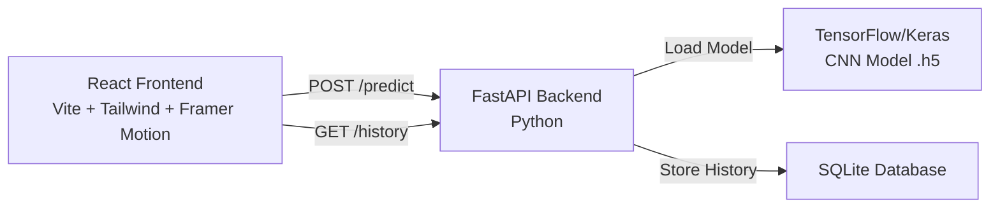

# Savora – Savor Every Bite | Implementation Plan

A full-stack AI-powered food calorie estimation platform with CNN-based classification, FastAPI backend, and a visually stunning React frontend.

## User Review Required

> [!IMPORTANT]
> **Dataset Choice**: We'll use a **subset of Food-101** (10 popular food categories) for practical training on your machine. Training on all 101 classes requires significant GPU time. Is a 10-class subset acceptable for demo purposes, or do you want all 101 classes?

> [!IMPORTANT]
> **Database Choice**: The plan uses **SQLite** (zero-config, file-based) for simplicity and easy local demo. No need to install PostgreSQL or MongoDB. Is this acceptable?

> [!WARNING]
> **GPU/Training Time**: Training a CNN model without a GPU can take 30-60 minutes even on 10 classes. We'll provide a pre-built nutrition mapping so the app works immediately even before training completes.

---

## Architecture Overview

---

## Proposed Changes

### 1. Model Training (`/model`)

#### [NEW] model/train.py
- CNN model using **TensorFlow/Keras with MobileNetV2** transfer learning
- Food-101 subset (10 classes): pizza, sushi, hamburger, ice_cream, french_fries, ramen, steak, fried_rice, tacos, salad
- Data preprocessing: resize to 224×224, normalize to [0,1]
- Data augmentation: rotation, horizontal flip, zoom, brightness
- Train/validation split (80/20)
- Save model as `food_model.h5`
- Generate accuracy/loss plots saved as PNG

#### [NEW] model/nutrition_data.json
- Hardcoded nutrition mapping for each food class (calories, protein, carbs, fats per serving)
- Based on USDA average values
- Includes health tips per food

#### [NEW] model/download_dataset.py
- Script to download Food-101 subset from Kaggle/TF Datasets
- Organizes into train/val directories

#### [NEW] model/requirements.txt
- tensorflow, numpy, matplotlib, Pillow

---

### 2. Backend (`/backend`)

#### [NEW] backend/main.py
- **FastAPI** application
- `POST /predict` — accepts image upload, preprocesses, runs model inference, returns `{food_name, calories, protein, carbs, fats, confidence, health_tip}`
- `GET /history` — returns all past predictions
- `DELETE /history/{id}` — delete a history entry
- CORS middleware for frontend communication
- Model loaded once at startup

#### [NEW] backend/database.py
- SQLite database setup with `predictions` table
- Schema: `id, food_name, calories, protein, carbs, fats, confidence, health_tip, image_filename, timestamp`

#### [NEW] backend/requirements.txt
- fastapi, uvicorn, tensorflow, Pillow, numpy, python-multipart, aiosqlite

---

### 3. Frontend (`/frontend`)

Built with **React + Vite + Tailwind CSS v4 + Framer Motion + Recharts**

#### [NEW] Core Setup Files
- `package.json` — dependencies: react, react-dom, react-router-dom, framer-motion, recharts, react-dropzone, react-hot-toast, lucide-react
- `vite.config.js` — Vite + React + Tailwind plugin
- `tailwind.config.js` — custom theme (colors, fonts, glassmorphism utilities)
- `src/index.css` — Tailwind imports, custom CSS variables, glassmorphism classes, gradient backgrounds, theme (dark/light)

#### [NEW] src/App.jsx
- React Router setup with 3 routes: `/`, `/dashboard`, `/history`
- Theme context provider (dark/light mode)
- Global layout with animated page transitions

#### [NEW] src/components/Navbar.jsx
- Sticky glassmorphic navbar
- Logo + navigation links
- Dark/light mode toggle with smooth animation
- Mobile hamburger menu

#### [NEW] src/pages/LandingPage.jsx
- Hero section: "Savora – Savor Every Bite, Smartly" tagline
- Animated food visuals (floating food emojis/illustrations with Framer Motion)
- Feature cards (glassmorphism)
- CTA button → Dashboard
- Smooth scroll animations on reveal

#### [NEW] src/pages/Dashboard.jsx
- **Image upload** area (drag & drop via react-dropzone + click to browse)
- **Camera capture** button (uses `navigator.mediaDevices.getUserMedia`)
- **Prediction results card**: food name, confidence score badge, calorie count
- **Nutrition breakdown**: Recharts PieChart (macros) + BarChart (detailed)
- **Health tip** card with icon
- **Loader animation** while predicting (pulsing food icon + progress ring)
- All sections animated with Framer Motion

#### [NEW] src/pages/HistoryPage.jsx
- Grid of past scan cards
- Each card: food image thumbnail, food name, calories, timestamp
- Delete button per entry
- Empty state illustration

#### [NEW] src/components/ThemeContext.jsx
- React context for dark/light mode
- Persists preference to localStorage

#### [NEW] src/components/NutritionChart.jsx
- Recharts PieChart for macronutrient breakdown
- Recharts BarChart for detailed view
- Animated chart transitions

#### [NEW] src/components/LoaderAnimation.jsx
- Beautiful CSS + Framer Motion loading animation
- Pulsing food icon with orbiting dots

#### [NEW] src/components/ConfidenceIndicator.jsx
- Visual confidence score (circular progress ring)
- Color-coded: green (>80%), yellow (50-80%), red (<50%)

### Design System
| Token | Light | Dark |
|-------|-------|------|
| Background | `#faf9f6` warm white | `#0f0f14` deep dark |
| Surface | `rgba(255,255,255,0.7)` glass | `rgba(30,30,40,0.7)` glass |
| Primary | `#f97316` (warm orange) | `#fb923c` |
| Accent | `#8b5cf6` (violet) | `#a78bfa` |
| Text | `#1e1e2e` | `#f5f5f5` |

---

### 4. Root Project Files

#### [NEW] README.md
- Project overview, screenshots placeholder
- Setup instructions for model training, backend, frontend
- Tech stack description

---

## Open Questions

> [!IMPORTANT]
> 1. **10-class Food-101 subset** vs full 101 classes — the subset is much faster to train and sufficient for demo. Your preference?

> [!IMPORTANT]  
> 2. **SQLite** (zero install, file-based) vs **PostgreSQL/MongoDB** — SQLite is ideal for local demo. Acceptable?

> [!NOTE]
> 3. The app will work in **demo mode** with a simulated model response if the trained `.h5` file isn't present yet. This way you can demo the full UI immediately while the model trains separately.

---

## Verification Plan

### Automated Tests
1. Run `python model/train.py` — verify model saves to `model/food_model.h5` and plots generate
2. Run `uvicorn backend.main:app --reload` — verify `/predict` and `/history` endpoints via Swagger UI at `/docs`
3. Run `npm run dev` in `/frontend` — verify all 3 pages render correctly in browser
4. End-to-end: upload an image from the Dashboard and verify prediction result appears

### Manual Verification
- Visual inspection of all pages (landing, dashboard, history) in both dark and light modes
- Test drag & drop upload, camera capture
- Verify nutrition charts render with correct data
- Test responsive design at mobile viewport
- Verify loader animation during prediction
